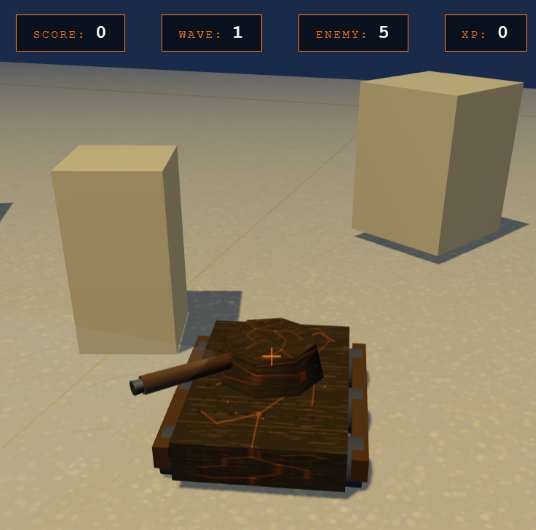

# 🛡️ Cyber-Tank Arena: Nomads

> A dynamic 3D top-down shooter set in a futuristic nomadic world. Control a cyber tank, destroy waves of hostile drones, and survive in a technologically advanced steppe arena.


---

## 📷 Gameplay

---

## 🎮 Project Overview

Cyber-Tank Arena: Nomads is an interactive 3D browser game developed using **Three.js** and **JavaScript ES6 modules**.

The player controls a cybernetic tank in a futuristic arena inspired by nomadic culture and steppe landscapes. The objective is to survive increasingly difficult enemy waves, destroy hostile drones, avoid obstacles, and achieve the highest possible score.

The project was developed for the **Interactive Graphics** course and demonstrates the use of:

* Hierarchical modelling
* Multiple light sources
* Procedural texture generation
* User interaction
* Real-time animations
* Collision detection
* Modular game architecture

---

## ✨ Features

* 🛡️ Hierarchical tank model with independently animated parts
* 💡 Multiple light sources (Ambient, Directional, Spot, Point)
* 🎨 Procedural textures generated using the Canvas API
* 🎯 Mouse-based turret aiming using raycasting
* 🔫 Shooting system with muzzle flash effects
* 🚁 Enemy drone AI with wave progression
* 📈 Score, XP, and health tracking system
* ⚡ Tween.js-powered animations
* 🚧 Obstacle collision detection
* 🌌 Atmospheric arena with stars and futuristic structures
* 🔦 Interactive tank headlights
* 💀 Game Over and restart system

---

## 🎮 Play

Open the project using **Live Server** in Visual Studio Code.

No installation, build tools, or external dependencies are required.

### Steps

1. Open the project folder in VS Code.
2. Install the **Live Server** extension if necessary.
3. Open `index.html`.
4. Click **"Open with Live Server"**.
5. Enjoy the game directly in your browser.

---

## 🕹️ Controls

| Key               | Action            |
| ----------------- | ----------------- |
| W / ↑             | Move Forward      |
| S / ↓             | Move Backward     |
| A / ←             | Move Left         |
| D / →             | Move Right        |
| Mouse             | Aim Turret        |
| Left Mouse Button | Shoot             |
| L                 | Toggle Headlights |

---

## 🏗️ Project Structure

```text
project/
│
├── index.html
├── css/
│   └── style.css
│
├── js/
│   ├── main.js
│   ├── scene.js
│   ├── tank.js
│   ├── arena.js
│   ├── enemy.js
│   ├── bullet.js
│   ├── lights.js
│   ├── textures.js
│   ├── input.js
│   └── hud.js
│
└── README.md
```

---

## 🛠 Technologies

* Three.js
* Tween.js
* JavaScript (ES6 Modules)
* HTML5
* CSS3

---

## 🎨 Graphics Features

### Hierarchical Model

The player tank is implemented as a hierarchical model:

```text
tankGroup
 └── chassis
      ├── wheels
      └── turretGroup
            └── barrelGroup
                  └── muzzleTip
```

This structure allows independent animation of movement, turret rotation, wheel rotation, and barrel recoil.

### Lighting

The project uses four different light sources:

* AmbientLight
* DirectionalLight
* SpotLight (Headlights)
* PointLight (Muzzle Flash)

### Procedural Textures

All textures are generated programmatically using the HTML Canvas API:

* Base Color Map
* Normal Map
* Roughness Map
* Emissive Map
* Ground Texture

---

## 🎥 Animations

The game includes multiple real-time animations:

* Tank movement
* Chassis rotation
* Wheel rotation
* Turret tracking
* Barrel recoil
* Muzzle flash effect
* Enemy movement
* Enemy targeting
* Enemy shooting
* Camera follow system
* Wave announcements

Animations are implemented directly in JavaScript using **Tween.js** where smooth interpolation is required.

---

## 🚀 Future Improvements

Possible future extensions:

* Sound effects and background music
* Additional enemy types
* Power-ups and upgrades
* Advanced particle effects
* Boss battles
* Multiplayer support
* Physics engine integration

---

## 🎓 Academic Context

This project was developed for the **Interactive Graphics** course.

**Professor:** Marco Schaerf

Department of Computer, Control and Management Engineering (DIAG)

Sapienza University of Rome

2025
